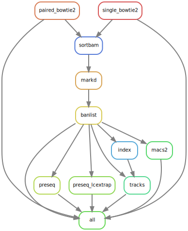

# ChIP-Seq Pipeline

Process both single and paired-end ChIP-Seq data with this pipeline. 

## 1 Prepare your work environment

Step 1 sets up the folder where all the analyses will take place.

```bash
# clone this repo to a new working directory
git clone git@github.com:maxsonBraunLab/chip_seq

# navigate to raw sample folder
cd data/raw

# symlink files to this directory
ln -s /absolute/path/to/files/condition1_H3K4me3_R1.fastq.gz .
ln -s /absolute/path/to/files/condition1_H3K4me3_R2.fastq.gz .
ln -s /absolute/path/to/files/condition2_H3K4me3.fastq.gz .

# rename symlinks to match {condition}_{replicate}_{mark}_{read}.fastq.gz for PE reads
mv condition1_H3K4me3_R1.fastq.gz condition_1_H3K4me3_R1.fastq.gz
mv condition1_H3K4me3_R2.fastq.gz condition_1_H3K4me3_R2.fastq.gz

# rename symlinks to match {condition}_{replicate}_{mark}/fastq.gz for SE reads
mv condition2_H3K4me3.fastq.gz condition_2_H3K4me3.fastq.gz
```

Make sure to have the input files follow the format:

* Paired-ends: `{condition}_{replicate}_{mark}_{read}.fastq.gz`
  * Only "R1" and "R2" are acceptable values for `{read}`
* Single-ends: `{condition}_{replicate}_{mark}.fastq.gz`


## 2 Prepare your conda environment

Step 2 performs a clean install of snakemake to a conda environment. This step assumes you already have an installation of anaconda or miniconda. 

```bash
# make a clean install of snakemake in a new env
conda install -c conda-forge mamba
mamba create -c conda-forge -c bioconda -n snakemake snakemake

conda activate snakemake
conda install -c plotly plotly
```

## 3 Prepare your pipeline configuration

Step 3 allows you to change the pipeline settings to your experiment's parameters such as reference genome and differential expression schemes. 

1. Run the following: `python scripts/make_sample_sheets.py data/raw`

   1. If you are not using "IgG" as a control, you can specify the control string so we can build a sample sheet in this step. Like `python scripts/make_sample_sheets.py data/raw input` . 

2. Edit the`config/samplesheet.tsv` to define which samples use which controls. A control column can be left blank if no controls are required. The following is an example of a correctly configured sample sheet. 

   ```
   sample	control	peak
   control_1_H3K27Ac	control_1_IgG	narrow
   control_2_H3K27Ac	control_2_IgG	narrow
   drug_1_H3K27Ac	drug_1_IgG	narrow
   drug_2_H3K27Ac	drug_2_IgG	narrow
   drug_1_H3K27me3	drug_1_IgG	broad
   drug_2_H3K27me3	drug_2_IgG	broad
   drug_1_CTCF		narrow
   drug_2_CTCF		narrow
   ```


## Methods


